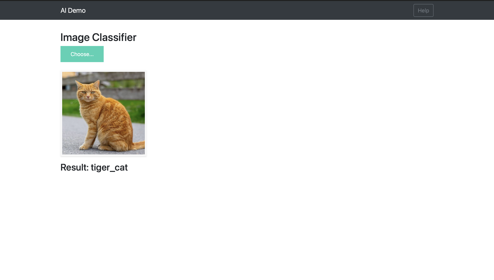
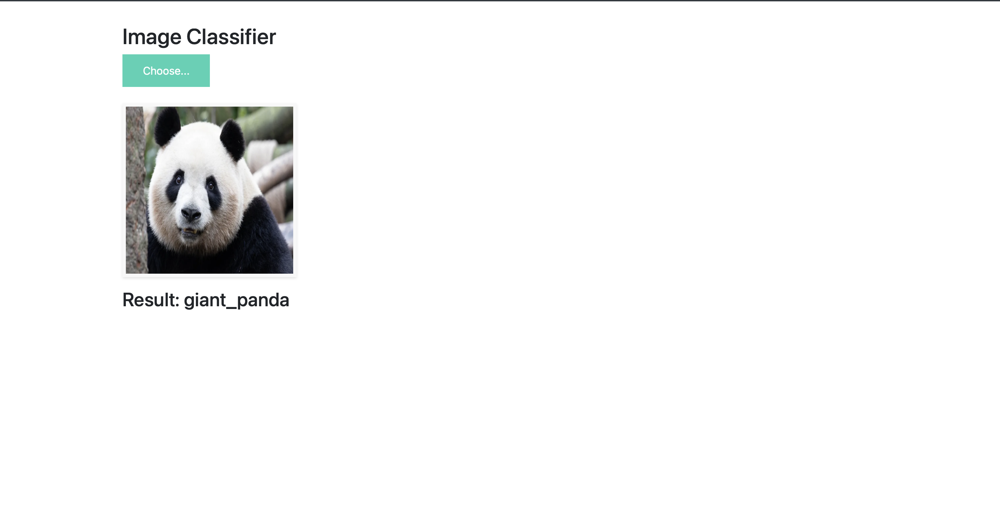

# Flask Image Classifier (VGG19)

A web-based image classification application built using **Flask** and **TensorFlow/Keras**, leveraging a pre-trained **VGG19** deep learning model for inference.

---

## 🚀 Features
- Upload images through a simple web interface
- Real-time image classification using a deep learning model
- AJAX-based prediction (no page reloads)
- Clean separation of backend (Flask) and frontend (HTML/CSS/JS)

---

## 🧠 Model Information

This project uses a **VGG19** model trained on the **ImageNet** dataset.

⚠️ **Model Weights Not Included**

The trained model file (`vgg19.h5`) is **not included** in this repository due to GitHub’s file size limits.

### To run the app locally:
1. Obtain a VGG19 `.h5` model (ImageNet pre-trained or custom trained)
2. Place the file inside the `model/` directory with the exact name:
## Demo




---

## 🛠 Tech Stack

- **Backend:** Flask (Python)
- **Deep Learning:** TensorFlow / Keras
- **Model:** VGG19
- **Frontend:** HTML, CSS, JavaScript
- **AJAX:** jQuery

---

## 📂 Project Structure

  flask_image_classifier/
  ├── app.py
  ├── model/
  │   └── vgg19.h5        # (not included, add manually)
  ├── templates/
  │   ├── base.html
  │   └── index.html
  ├── static/
  │   ├── css/
  │   └── js/
  ├── screenshots/
  ├── notebooks/
  ├── uploads/
  ├── requirements.txt
  ├── README.md
  └── .gitignore

---

## ▶️ How It Works

1. User uploads an image via the web UI
2. Flask saves the image temporarily
3. The image is preprocessed and passed to the VGG19 model
4. The model predicts the most likely ImageNet class
5. The result is returned asynchronously and displayed on the UI

---

## ⚙️ Setup Instructions

### 1️⃣ Create and activate environment
```bash
conda create -n tf310 python=3.10
conda activate tf310

2️⃣ Install dependencies

pip install -r requirements.txt

3️⃣ Add model weights

Place vgg19.h5 inside the model/ directory.

4️⃣ Run the app

python app.py

Open your browser at: http://127.0.0.1:5000
